# Quran MAUI Blazor Hybrid Application

A comprehensive Quran study tool, designed for the Uzbek language, leveraging the power of .NET Multi-platform App UI (MAUI) and Blazor Hybrid technologies.

## Key Features

- **Uzbek Translation**: Offers a comprehensive Quran translation in Uzbek, presented alongside the original Arabic text.

- **Sura and Aya Listing**: Displays a detailed list of Suras and Ayas, each with its original Arabic text, translation, and additional comments.

- **Bookmarking**: Allows users to bookmark specific Ayas for future reference.

- **Note-Taking**: Enables users to take notes for each Aya, facilitating personal reflections and additional research.

- **Customizable Font Size**: Provides an option to adjust the font size for enhanced readability.

- **Search Functionality**: Includes a search feature for exploring Aya translations and comments.

- **Go to Aya**: Allows direct navigation to a specific Aya.

- **Resume Reading**: Marks the last reading position, enabling users to resume from where they left off.

- **Sharing**: Facilitates sharing Ayas and notes with others.

- **Database Integration**: Integrates with an existing database for a rich, detailed, and accurate source of Quranic text, translations, and comments.

## Update log

### Version 1.0.1 (2024-10-10)
* Fixed some errors in content.
* improved UI and some features.

### Version 1.0.0 (2024-04-27)
* First release

## Screenshots

### Phone Screenshots

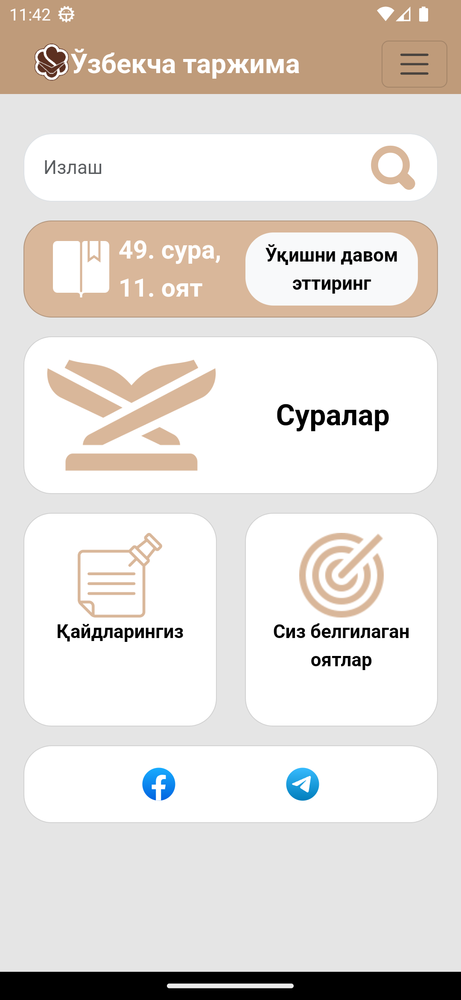

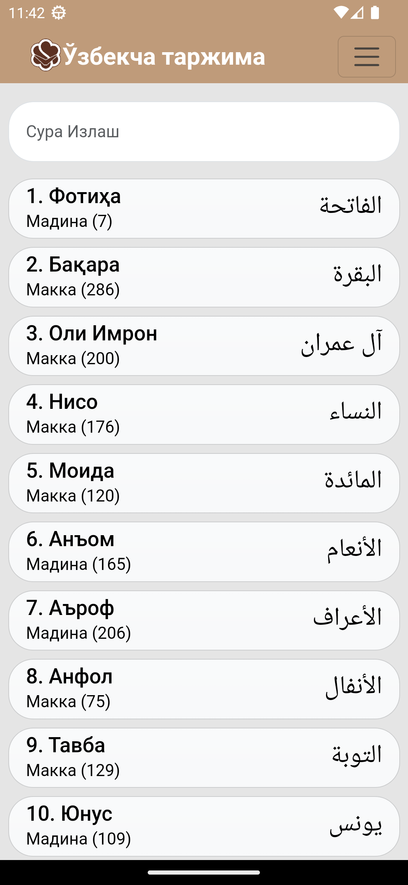

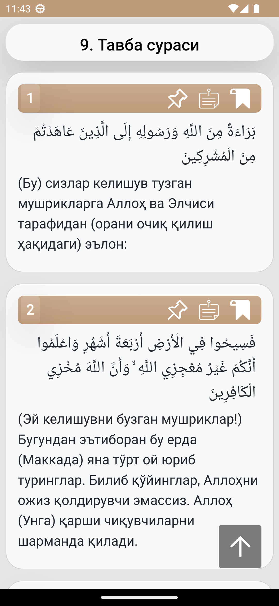

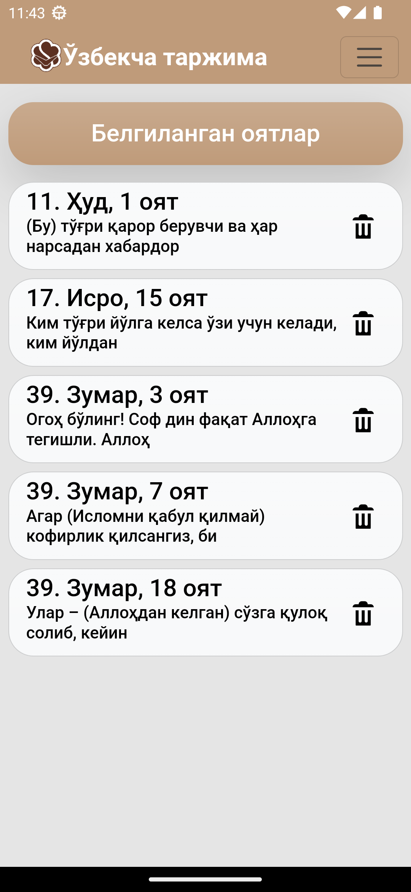

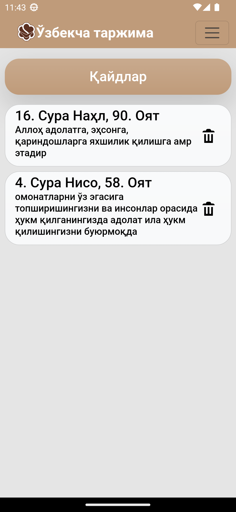

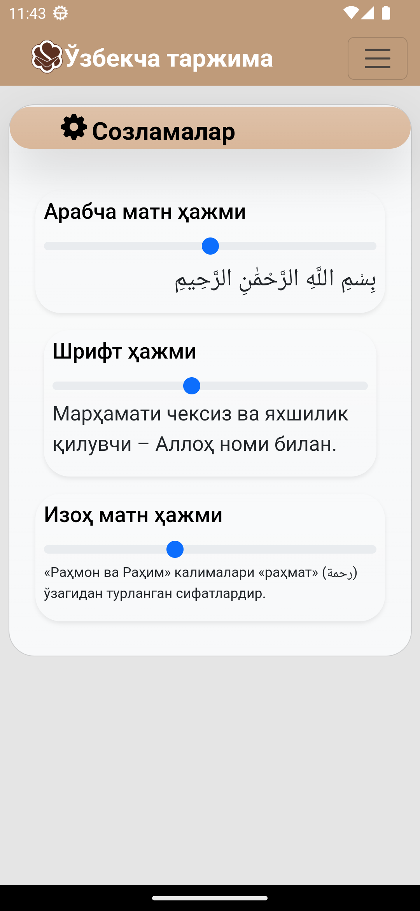

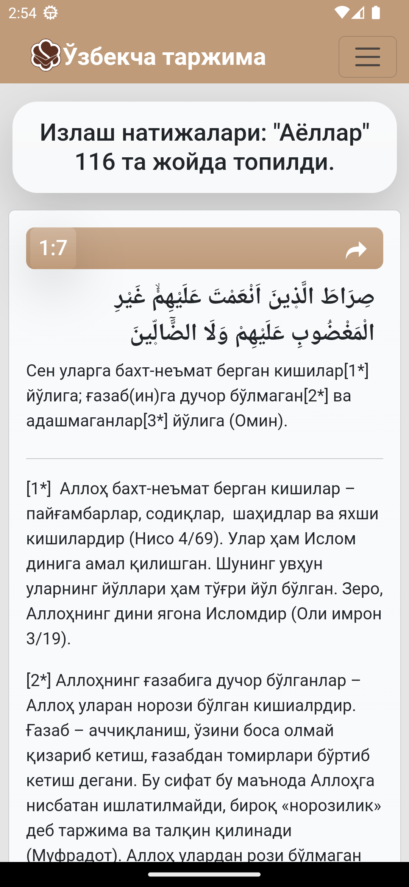

### Tablet Screenshots

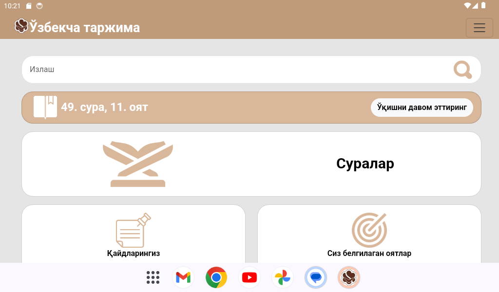

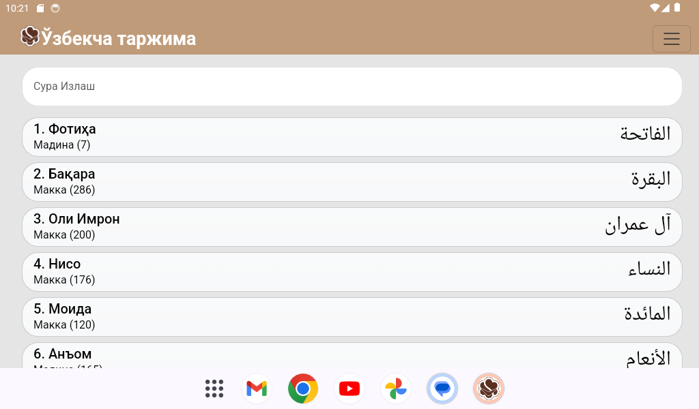

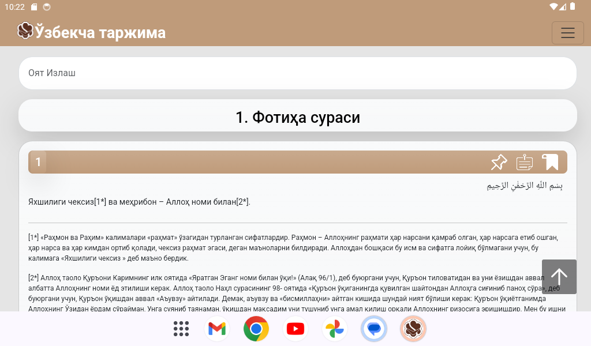

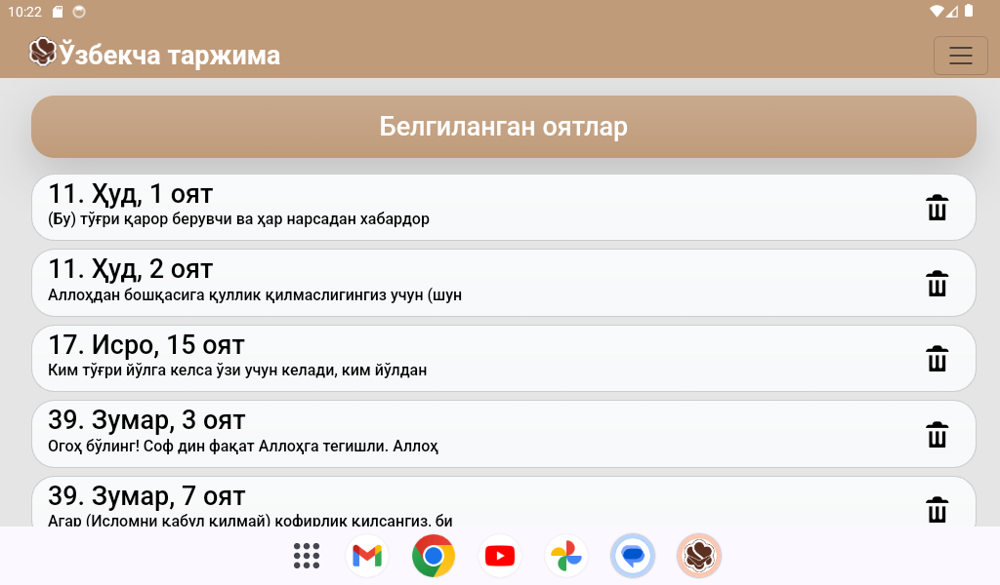

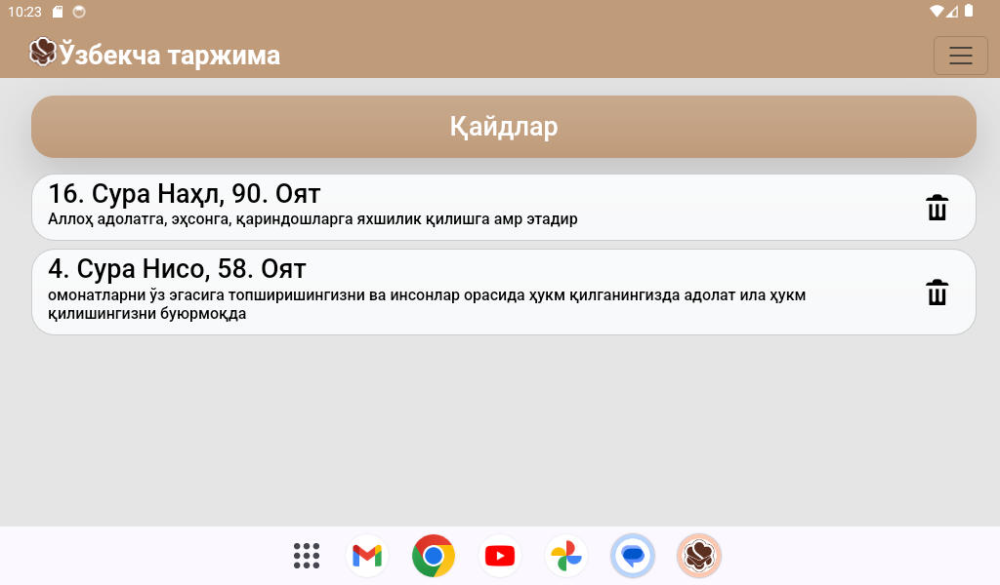

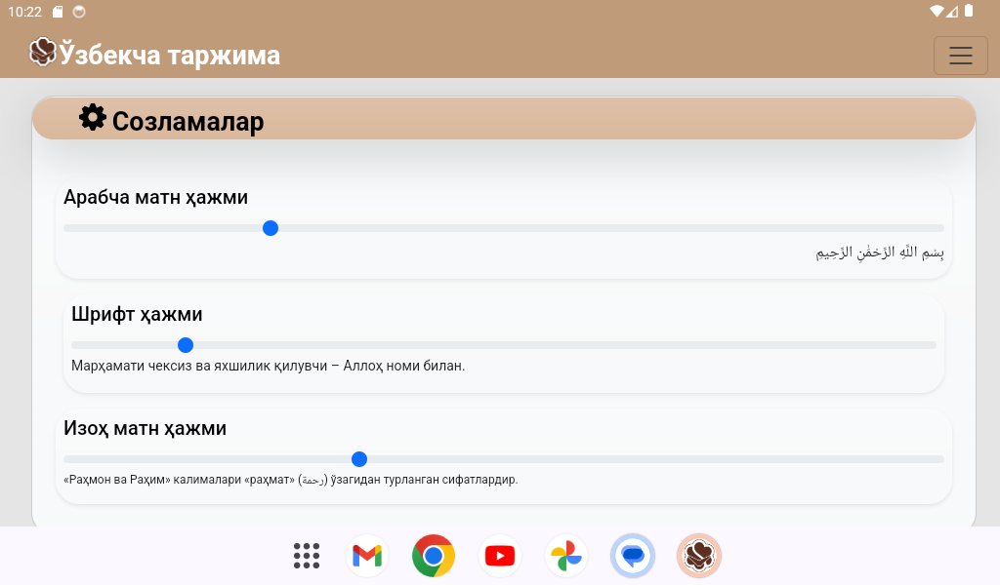

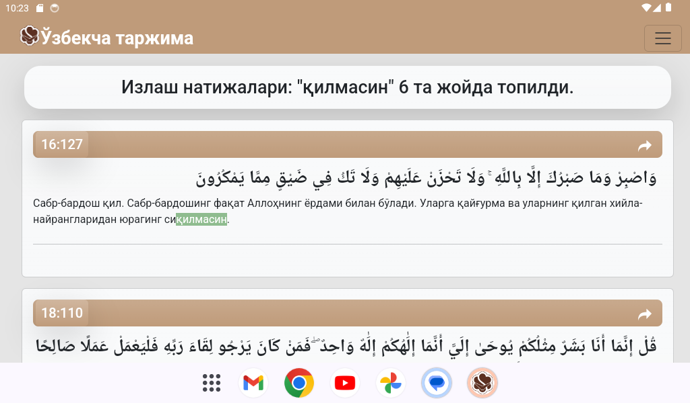

## Future Enhancements

- ~~**Note Existence Check**: To prevent duplication, the application will verify the existence of a note for a specific Aya before adding a new one.~~

- **UI Optimization**: Future updates will focus on enhancing the user interface for a better user experience.

## Potential Feature Ideas

- **Database Update via Web API**: A potential feature could be the ability to update the database through the internet via a web API, allowing for real-time updates and additions to the Quranic text, translations, and comments.

## Contributing

Contributions from the community are welcome.

## License

This project is licensed under the terms of the GPL-3.0 license.
